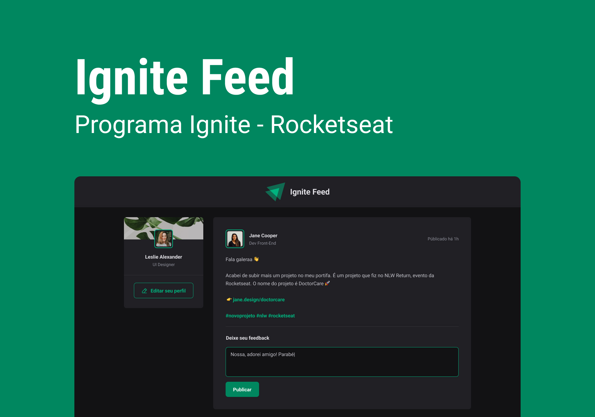

<h1 align="center"> Ignite Feed </h1>

Projeto desenvolvido na Trilha ReactJS do Ignite.
 

  <a href="#-tecnologias">Tecnologias</a>&nbsp;&nbsp;&nbsp;|&nbsp;&nbsp;&nbsp;
  <a href="#-projeto">Projeto</a>&nbsp;&nbsp;&nbsp;|&nbsp;&nbsp;&nbsp;
  <a href="#-layout">Layout</a>&nbsp;&nbsp;&nbsp;|&nbsp;&nbsp;&nbsp;
  <a href="#-licença">Licença</a>

  

 

  

## 🚀 Tecnologias

Esse projeto foi desenvolvido com as seguintes tecnologias:

- React + Typescript
- Git e Github
- Figma

## 💻 Projeto

Projeto que simula um Feed com postagens, perfil com avatar e interações como: Aplaudir, comentar e deletar o comentário

## 🔖 Layout

Você pode visualizar o layout do projeto através [DESSE LINK](https://www.figma.com/community/file/1113573231685349036/ignite-feed). É necessário ter conta no [Figma](https://figma.com) para acessá-lo.

## 📝 Licença

Esse projeto está sob a licença MIT.

---

Feito com ♥ by Vitor Madalosso :wave: [Participe da comunidade da Rocketseat!](https://discord.gg/rocketseat)
